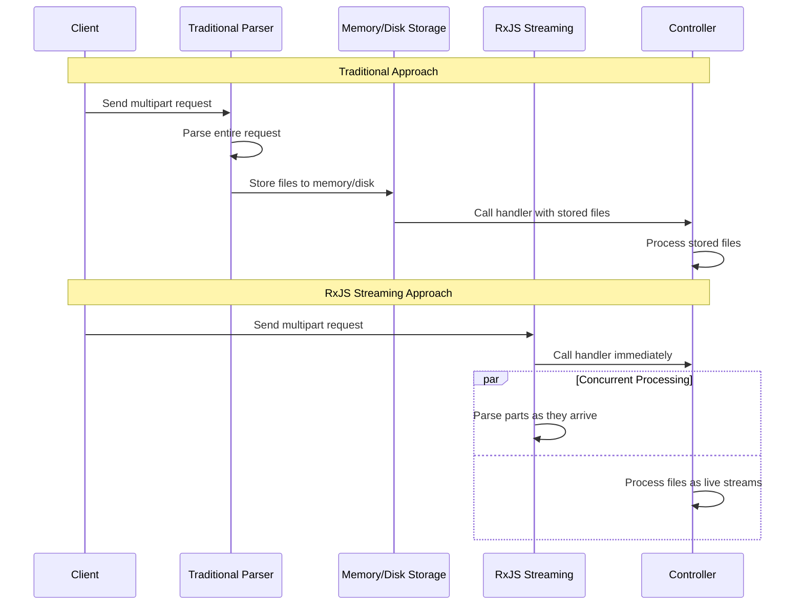

# @proventuslabs/nestjs-multipart-form

A lightweight and efficient NestJS package for handling multipart form data and file uploads with RxJS streaming support and type safety.

## ✨ Features

- 🔄 **RxJS Streaming**: Process files/fields as they arrive
- 🎯 **Type-Safe**: Full TypeScript support with `MultipartFileStream` and `MultipartFileBuffer`
- 🔧 **Composable Operators**: Reusable operators for filtering, validation, and transformation
- 🛡️ **Pattern Matching**: Support for exact matches and "starts with" patterns (`^prefix_`)
- 🚨 **Error Handling**: Built-in validation with proper HTTP status codes

## 🔄 Key Difference: Streaming vs Traditional Parsing

Unlike traditional multipart form handling where the entire request is parsed **before** your controller handler is called, this package processes the multipart data **concurrently** with your controller execution using RxJS streams.

### Traditional Approach
```
Request → Parse & Store to Memory/Disk → Controller Handler Called → Process Stored Files
```
*Files must be fully buffered in memory or written to disk before your controller can access them.*

### RxJS Streaming Approach
```
Request → Start Parsing → Controller Handler Called → Process Files as Streams
                ↓
            Files arrive as they're parsed
```
*Files are processed as live streams - no intermediate storage required.*



## 📦 Installation

```bash
npm install @proventuslabs/nestjs-multipart-form
```


## 🎯 Quick Start

```typescript
import { Controller, Post, UseInterceptors, UseFilters } from '@nestjs/common';
import { 
  MultipartFiles, 
  MultipartFields,
  MultipartInterceptor,
  MultipartExceptionFilter,
  bufferFiles,
  collectToRecord,
  type MultipartFileStream,
  type MultipartField
} from '@proventuslabs/nestjs-multipart-form';
import { Observable, firstValueFrom, toArray } from 'rxjs';

@Controller('upload')
@UseFilters(MultipartExceptionFilter)
export class UploadController {
  @Post('files')
  @UseInterceptors(MultipartInterceptor())
  async uploadFiles(
    @MultipartFiles(['document']) files$: Observable<MultipartFileStream>,
    @MultipartFields(['name']) fields$: Observable<MultipartField>
  ) {
    const [files, form] = await Promise.all([
      firstValueFrom(files$.pipe(bufferFiles(), toArray())),
      firstValueFrom(fields$.pipe(collectToRecord()))
    ]);

    return { files, form };
  }
}
```

## 📋 API Reference

### Decorators

```typescript
@MultipartFiles() // All files
@MultipartFiles('fieldname') // Single required field
@MultipartFiles(['field1', 'field2']) // Multiple required fields
@MultipartFiles([['field1'], ['field2', false]]) // Mixed required/optional

@MultipartFields() // All fields
@MultipartFields('name') // Single required field
@MultipartFields(['name', '^user_']) // Pattern matching support
@MultipartFields([['name'], ['meta', false]]) // Mixed required/optional
```

**Pattern Matching:**
- `"fieldname"` - Exact match
- `"^prefix_"` - Fields starting with "prefix_"

### RxJS Operators

**Field Operators:**
```typescript
import { 
  associateFields,      // Parse field[key] syntax
  collectAssociatives,  // Collect into objects/arrays using qs
  collectToRecord,      // Convert to simple key-value record
  filterFieldsByPatterns,    // Filter by patterns
  validateRequiredFields     // Validate required patterns
} from '@proventuslabs/nestjs-multipart-form';
```

**File Operators:**
```typescript
import {
  filterFilesByFieldNames,  // Filter files by field names
  validateRequiredFiles,    // Validate required files
  bufferFiles              // Convert streams to MultipartFileBuffer
} from '@proventuslabs/nestjs-multipart-form';
```

### Advanced Usage

```typescript
@Post('upload')
@UseInterceptors(MultipartInterceptor())
async handleUpload(
  @MultipartFields() fields$: Observable<MultipartField>,
  @MultipartFiles() files$: Observable<MultipartFileStream>
) {
  const formData$ = fields$.pipe(
    filterFieldsByPatterns(['name', '^user_']),
    validateRequiredFields(['name']),
    collectToRecord()
  );

  const bufferedFiles$ = files$.pipe(
    filterFilesByFieldNames(['document']),
    validateRequiredFiles(['document']),
    bufferFiles()
  );

  return { 
    form: await firstValueFrom(formData$),
    files: await firstValueFrom(bufferedFiles$.pipe(toArray()))
  };
}
```

## 🔧 Configuration

```typescript
import { Module } from '@nestjs/common';
import { MultipartModule } from '@proventuslabs/nestjs-multipart-form';

@Module({
  imports: [
    MultipartModule.register({
      limits: { 
        fileSize: 10 * 1024 * 1024, // 10MB
        files: 5
      },
      autodrain: true, // Auto-drain unread files (default: true)
      bubbleErrors: false // Bubble errors after controller ends (default: false)
    })
  ]
})
export class AppModule {}
```

## 🚨 Error Handling

Built-in error types automatically mapped to HTTP status codes:
- **MissingFilesError**, **MissingFieldsError** → 400 Bad Request
- **FilesLimitError**, **FieldsLimitError**, **PartsLimitError** → 413 Payload Too Large  
- **TruncatedFileError**, **TruncatedFieldError** → 400 Bad Request

```typescript
@UseFilters(MultipartExceptionFilter)
export class UploadController {}
```

## 🎭 Types


```typescript
// Stream-based file (from decorators)
interface MultipartFileStream extends Readable, MultipartFileData {
  readonly truncated?: boolean;
}

// Buffered file (from bufferFiles() operator)  
interface MultipartFileBuffer extends Buffer, MultipartFileData {}

// Shared metadata
interface MultipartFileData {
  readonly fieldname: string;
  readonly filename: string; 
  readonly mimetype: string;
  readonly encoding: string;
}

// Field data
interface MultipartField {
  readonly name: string;
  readonly value: string;
  readonly mimetype: string;
  readonly encoding: string;
  // Enhanced by associateFields():
  isAssociative?: boolean;
  basename?: string;
  associations?: string[];
}
```

## ⚡ Best Practices

- Use streams for large files, buffers for small files
- Auto-draining prevents backpressure on unwanted streams  
- Process files concurrently as they arrive

```typescript
// ✅ Good: Stream processing for large files
files$.pipe(
  mergeMap(file => processFileStream(file)),
  toArray()
);

// ✅ Good: Buffer small files when needed
files$.pipe(
  bufferFiles(),
  map(file => ({ name: file.filename, data: file.toString('base64') })),
  toArray()
);
```

## 🤝 Contributing

We welcome contributions! Please see our [Contributing Guidelines](../../CONTRIBUTING.md) for details.

## 📄 License

This project is licensed under the MIT License - see the [LICENSE](../../LICENSE) file for details.

## 🔗 Links

- [ProventusLabs](https://proventuslabs.com)
- [NestJS Documentation](https://nestjs.com)
- [RxJS Documentation](https://rxjs.dev)
- [Busboy Documentation](https://github.com/mscdex/busboy)
